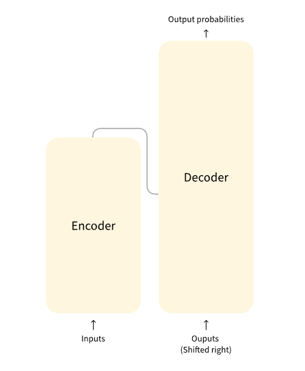
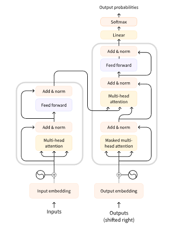

# Transformers

Base architecture

Full architecture

## Models

| Model           | Examples                                   | Tasks                                                                            |
| --------------- | ------------------------------------------ | -------------------------------------------------------------------------------- |
| Encoder         | ALBERT, BERT, DistilBERT, ELECTRA, RoBERTa | Sentence classification, named entity recognition, extractive question answering |
| Decoder         | CTRL, GPT, GPT-2, Transformer XL           | Text generation                                                                  |
| Encoder-decoder | BART, T5, Marian, mBART                    | Summarization, translation, generative question answering                        |

## Encoder only models

Encoder models use only the encoder of a Transformer model. At each stage, the attention layers can access all the words in the initial sentence. These models are often characterized as having “bi-directional” attention, and are often called auto-encoding models.

- ALBERT
- BERT
- DistilBERT
- ELECTRA
- RoBERTa

## Decoder only models

Decoder models use only the decoder of a Transformer model. At each stage, for a given word the attention layers can only access the words positioned before it in the sentence. These models are often called auto-regressive models.

- GPT
- GPT-2
- CTRL
- Transformer XL

## Encoder-Decoder models

Encoder-decoder models (also called sequence-to-sequence models) use both parts of the Transformer architecture. At each stage, the attention layers of the encoder can access all the words in the initial sentence, whereas the attention layers of the decoder can only access the words positioned before a given word in the input.

- BART
- mBART
- Marian
- T5
