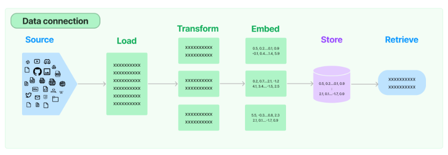

# Data

- Document loaders: Load documents from many different sources
- Document transformers: Split documents, drop redundant documents, and more
- Text embedding models: Take unstructured text and turn it into a list of floating point numbers
- Vector stores: Store and search over embedded data
- Retrievers: Query your data

